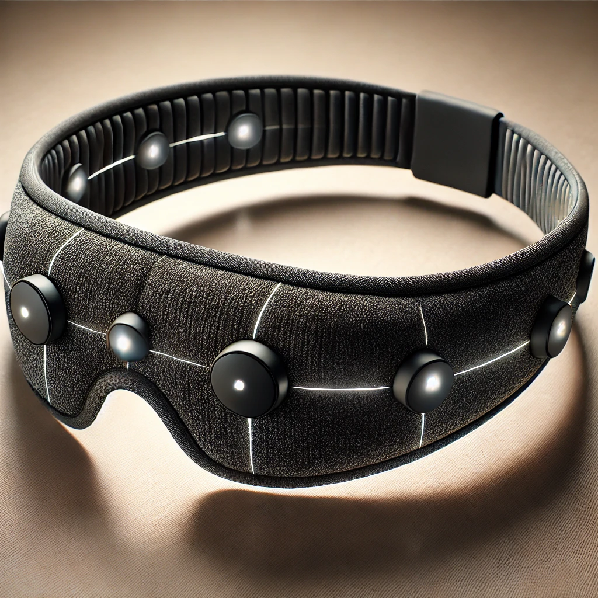
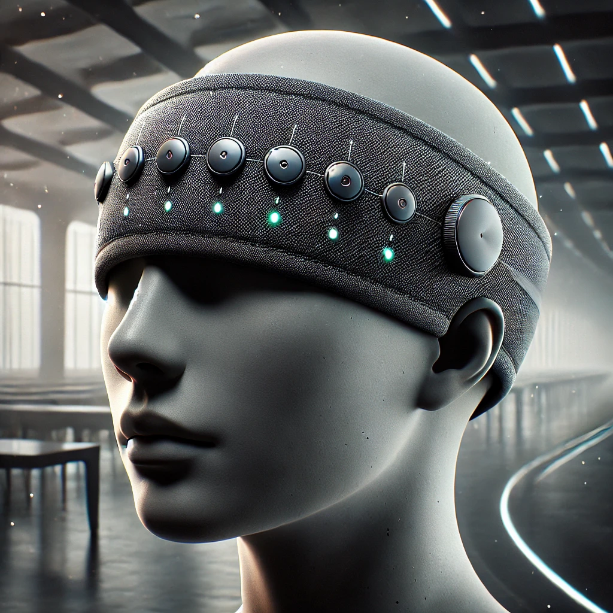
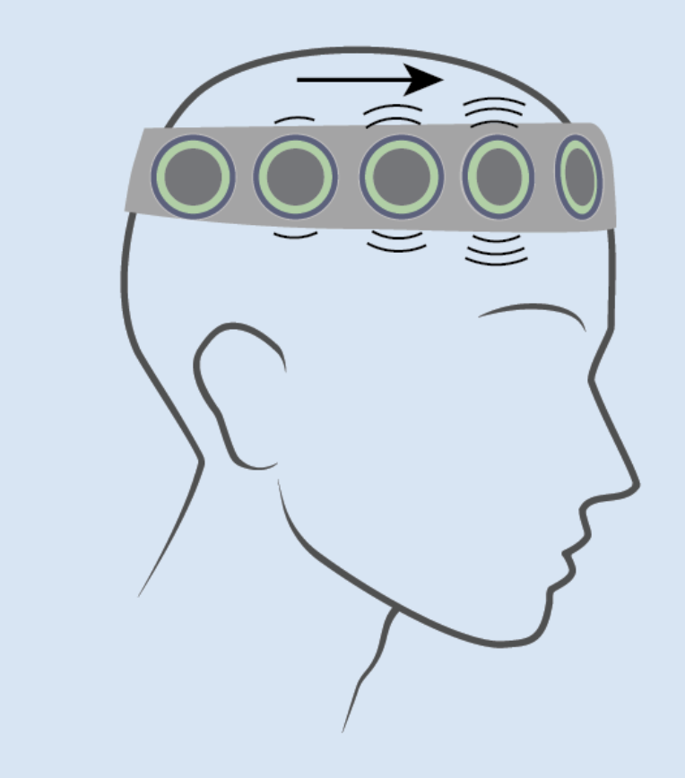
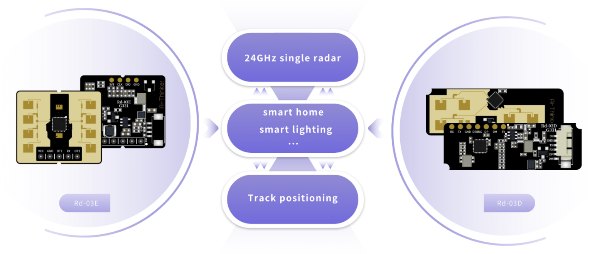
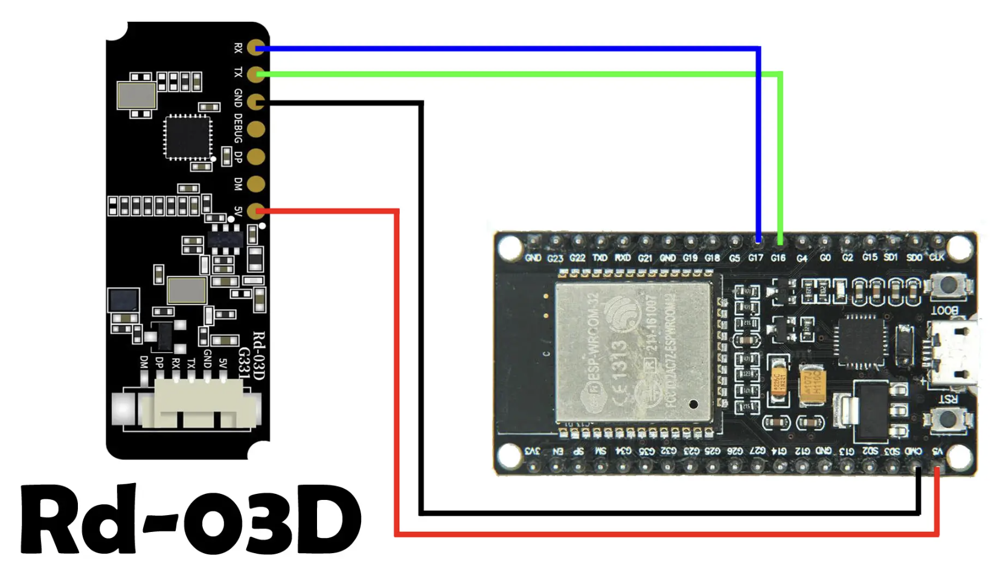
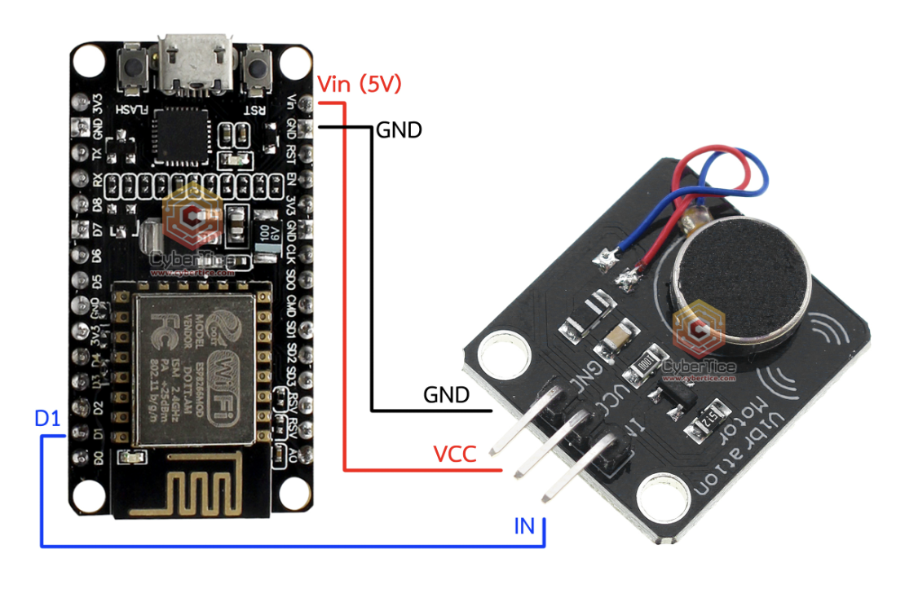
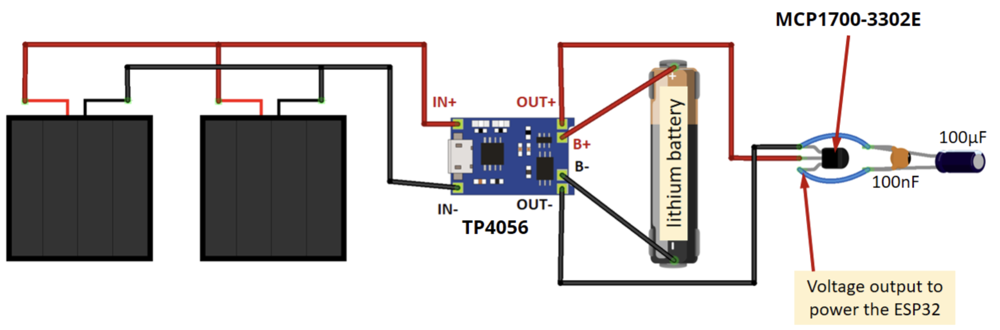

# Sistem navigimi per te verberit

## (Blind Navigation Headset)

 

Ky projekt ka per qellim krijimin e "syzeve" apo paisjes qe vendoset ne koke, per persona te cilet kan humbur shikimin apo per navigim ne erresire.
Kjo iniciative kerkon qe te krijohet paisje me nje strukture qe perbehet nga:

1. Helmete apo material me i bute sillastek apo plastike e 3d printuar, e lehte.
2. Mikrokontroller te llojit ESP32 apo STM32 apo Teensy apo Nordic Semiconductor, etj.
3. Radar senzore te tipit RD-03D apo RD-03E.
4. Motora vibrimi si Taptic Engine te iPhone apo te llojit "Vibration Motor G08".

Qellimi eshte te krijohet nje paisje e lire, funksionale, lehte e replikueshme.

### Helmeta apo kapela po "syzet" - trupi

Ne helmete apo "syza" duhet te vendoset nje bateri e cila e furnizon me energji sistemin.
Ky trup apo helmete apo "syza" duhet te jete sa me i lehte, qe te mund te perdoret per kohe ma te gjate.

### Mikrontrolleri

Radar senzoret RD-03\* perdorin UART komunikim, qe nenkupton serial komunikim. Motorret apo taptic engine perdor PWM output.
Tu i mar parasysh keto rrethana, nenkupton qe nji spekter i madh i mikrokontrollereve do te jete i pershtatshem per kete projekt.
Idealja do te ishte nje FPGA chip, mirepo, FPGA kerkon aftesi apo pervoje me te madhe ne kete fushe.

### Vibruesit apo "taptic engine" per ndjeshmeri te ambientit.

Keta jane motorre kinetik, te cilet permes intenzitetit transmetojne energji kinetike te ndryshme.
Kjo energji kinetike apo vibruese do te sherbej qe permes kafkes se njeriut te "ndjehet" apo "shihet ambienti".
Keta motorre do te kontrollohen permes PWM protokolllit, pinat te cilat e ja pin kete sherbim jane te ilustruar ne skemen per ESP32 me larte.

### Radari apo senzori i distances dhe kandit RD-03D apo RD-03E

Ky eshte nji senzor i cili punon ne frekuence 24GHz K-band dhe mundeson detektim preciz te objekteve ne kand prej 30 shkalle vertikalisht dhe 60 shkalle horizontalisht.
Keta senzore jane aq preciz sa mund te matin te rrahurat e zemres ne largesi deri ne 4 metra ne zonen 60-90 te rrahura per minut.

## Implementimi

Nderlidhjet fizike per te realizuar kete projekt:

1. Nderlidhja ne mes mikrokontrollerit dhe senzoreve apo radareve, permes serial apo UART pins ne ESP32 mikrokontroller.

2. Nderlidhja mes mikrokontrollerit dhe PWM motorreve, permes PWM pinave qe ndodhen ne ESP 32 mikrokontroller.

3. Nderlidhja mes mikrokontrollerit dhe baterise. Gjate kohes se zhvillimit nuk ka nevoje nderlidhja me bateri, pershkak se, do te perdoret USB kabell qe te mund te punohet firmware apo kodi ne Arduino IDE.

## Do te ishte mire

Do te ishte mire qe ky projekt gjithashtu te perfshin edhe Gyroscope dhe Accelerometer, mundesisht edhe Magnetometer, qe te perdoret per "Sensor Fusion" mundesi edhe me te avancuara.
De te ishte mire qe ky projekt te permbaje gjithashtu edhe kamere, e cila permes "bone conducting" ndegjueseve te njoftoje shfrytezuesin me ze per ate qe kamera sheh permes AI intligjences artificiale.

## Skema qe mund te na lehtojne punen

Ne kete rast shihet nje skeme qe mundeson mbushjen e paisjes permes solareve.

## License

The MIT License (MIT)

Copyright (c) 2025 Enis Hyseni

Permission is hereby granted, free of charge, to any person obtaining a copy of this software and associated documentation files (the "Software"), to deal in the Software without restriction, including without limitation the rights to use, copy, modify, merge, publish, distribute, sublicense, and/or sell copies of the Software, and to permit persons to whom the Software is furnished to do so, subject to the following conditions:

The above copyright notice and this permission notice shall be included in all copies or substantial portions of the Software.

THE SOFTWARE IS PROVIDED "AS IS", WITHOUT WARRANTY OF ANY KIND, EXPRESS OR IMPLIED, INCLUDING BUT NOT LIMITED TO THE WARRANTIES OF MERCHANTABILITY, FITNESS FOR A PARTICULAR PURPOSE AND NONINFRINGEMENT. IN NO EVENT SHALL THE AUTHORS OR COPYRIGHT HOLDERS BE LIABLE FOR ANY CLAIM, DAMAGES OR OTHER LIABILITY, WHETHER IN AN ACTION OF CONTRACT, TORT OR OTHERWISE, ARISING FROM, OUT OF OR IN CONNECTION WITH THE SOFTWARE OR THE USE OR OTHER DEALINGS IN THE SOFTWARE.
