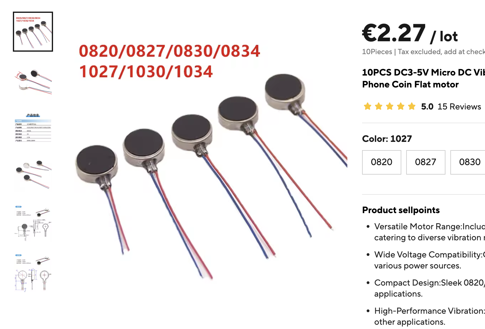
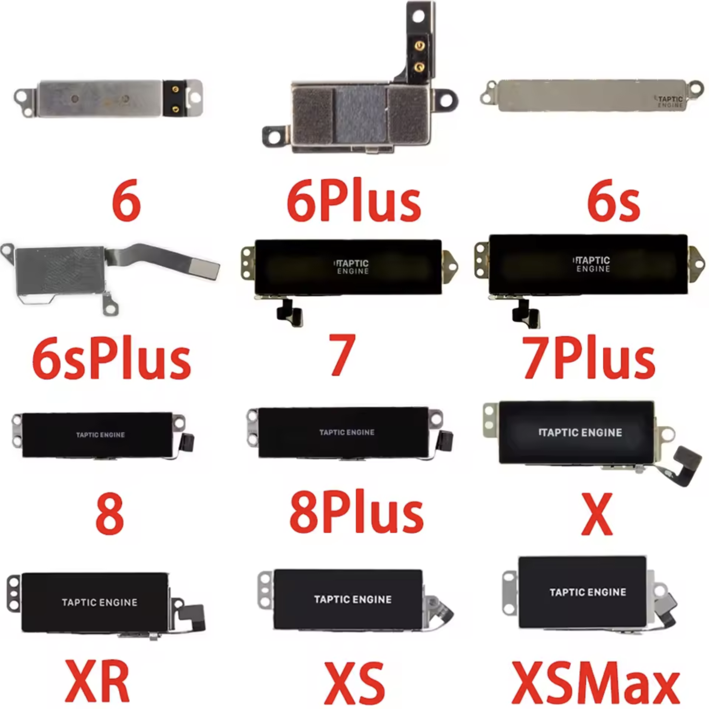

# Navigation System for the Blind

## (Blind Navigation Headset)

 

This project aims to create "glasses" or a device worn on the head for individuals who are visually impaired or for navigation in darkness. The initiative focuses on developing a device with a structure composed of:

1. A helmet or a softer elastic material or lightweight 3D-printed plastic.
2. Microcontrollers such as ESP32, STM32, Teensy, Nordic Semiconductor, etc.
3. Radar sensors like the RD-03D or RD-03E.
4. Vibration motors such as the Taptic Engine in iPhones or "Vibration Motor G08."

The goal is to create an affordable, functional, and easily replicable device.

---

### Helmet or Glasses - The Body

The helmet or "glasses" should include a battery to power the system.  
The body or helmet/glasses must be as lightweight as possible to allow for extended usage.

---

### Microcontroller

The RD-03\* radar sensors use UART communication, meaning serial communication. The motors or Taptic Engine use PWM output.  
Given these circumstances, a wide range of microcontrollers will be suitable for this project.  
Ideally, an FPGA chip would be used, but FPGA requires more advanced skills or experience in this field.

---

### Vibration Motors or Taptic Engine for Environmental Sensitivity

These are kinetic motors that transmit different levels of kinetic energy through intensity.  
This kinetic or vibrating energy helps "sense" or "see" the environment through the human skull.  
These motors will be controlled via the PWM protocol, as illustrated in the ESP32 schematic above.

 

---

### Radar or Distance and Angle Sensor RD-03D or RD-03E

This sensor operates at the 24GHz K-band frequency, enabling precise detection of objects at angles of 30° vertically and 60° horizontally.  
These sensors are so precise that they can measure heartbeats at a distance of up to 4 meters, within a range of 60–90 beats per minute.

---

## Implementation

Physical connections for this project:

1. **Connection between the microcontroller and sensors or radars**:  
   Use the UART pins on the ESP32 microcontroller for serial communication.

2. **Connection between the microcontroller and PWM motors**:  
   Use the PWM pins available on the ESP32 microcontroller.

3. **Connection between the microcontroller and the battery**:  
   During development, there’s no need to connect the battery because the USB cable will be used to upload firmware or code via the Arduino IDE.

---

## Recommendations

It would be beneficial if this project also included a **Gyroscope** and **Accelerometer**, possibly even a Magnetometer, to enable more advanced "Sensor Fusion" capabilities.  
Adding a camera would also be valuable. Using **bone-conducting headphones**, the device could notify the user through sound about what the camera sees, using Artificial Intelligence (AI).

---

## Schematics to Facilitate Development

Below is a schematic showing how to charge the device using solar panels.

---

## License

The MIT License (MIT)

Copyright (c) 2025 Enis Hyseni

Permission is hereby granted, free of charge, to any person obtaining a copy of this software/hardware and associated documentation files (the "Software/Hardware"), to deal in the Software/Hardware without restriction, including without limitation the rights to use, copy, modify, merge, publish, distribute, sublicense, and/or sell copies of the Software/Hardware, and to permit persons to whom the Software/Hardware is furnished to do so, subject to the following conditions:

The above copyright notice and this permission notice shall be included in all copies or substantial portions of the Software/Hardware.

THE SOFTWARE/HARDWARE IS PROVIDED "AS IS", WITHOUT WARRANTY OF ANY KIND, EXPRESS OR IMPLIED, INCLUDING BUT NOT LIMITED TO THE WARRANTIES OF MERCHANTABILITY, FITNESS FOR A PARTICULAR PURPOSE AND NONINFRINGEMENT. IN NO EVENT SHALL THE AUTHORS OR COPYRIGHT HOLDERS BE LIABLE FOR ANY CLAIM, DAMAGES OR OTHER LIABILITY, WHETHER IN AN ACTION OF CONTRACT, TORT OR OTHERWISE, ARISING FROM, OUT OF OR IN CONNECTION WITH THE SOFTWARE/HARDWARE OR THE USE OR OTHER DEALINGS IN THE SOFTWARE/HARDWARE.
